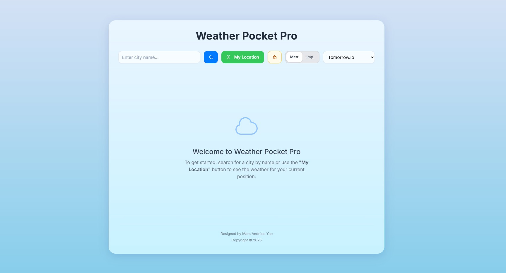

# Weather Pocket Pro

**Weather Pocket Pro** is a beautifully designed, user-centric weather application that provides accurate and reliable forecasts. Our mission is to deliver a seamless and intuitive experience, ensuring you are always prepared for the day ahead. In partnership with **MeteoBlue**, the leading Swiss provider of weather intelligence, we bring you precision and quality you can trust.



---

## Table of Contents

- [Features](#features)
- [Architecture](#architecture)
- [Technology Stack](#technology-stack)
- [Detailed Features](#detailed-features)
- [Getting Started](#getting-started)
- [Ethical Considerations](#ethical-considerations)
- [Future Improvements](#future-improvements)
- [Contributing](#contributing)
- [License](#license)

---

## Features

### Unparalleled Accuracy
- **MeteoBlue Integration**: Leveraging the power of MeteoBlue's world-class weather data for hyper-accurate forecasts.
- **Dual Provider System**: Seamlessly switch between OpenWeatherMap and Tomorrow.io for a comprehensive view.

### Intuitive User Experience
- **Sleek, Minimalist Design**: An Apple-inspired interface that is both beautiful and easy to navigate.
- **Real-time Weather**: Get up-to-the-minute weather updates for your current location or any city worldwide.
- **Interactive Maps**: Visualize weather patterns with our dynamic and responsive maps.

### Personalized for You
- **Customizable Units**: Switch between Metric and Imperial units to suit your preference.
- **Favorites**: Save your most-visited locations for quick access.
- **Smart Suggestions**: Autocomplete search functionality makes finding cities effortless.

---

## Architecture

Weather Pocket Pro follows a modern, component-based architecture designed for scalability and maintainability.

### Core Architecture Components

#### 1. Frontend Architecture
```
Weather-Pocket-Pro/
├── components/           # Reusable UI components
│   ├── Icons.tsx        # SVG icons and visual elements
│   └── MapComponents.tsx # Map-related components
├── services/            # Business logic and API services
│   └── api.ts          # Weather API integration
├── types/              # TypeScript type definitions
├── App.tsx             # Main application component
└── styles/            # Global styles and themes
```

#### 2. State Management
- **React Hooks**: Utilizing modern React patterns for efficient state management
- **Local Storage**: Persistent storage for user preferences and favorites
- **Context API**: Managing global application state

#### 3. Data Flow
```
User Interaction → React Components → API Services → Weather Providers → UI Update
```

#### 4. Component Architecture
- **Atomic Design Principles**: Following modular component structure
- **Smart/Dumb Component Pattern**: Separation of logic and presentation
- **Responsive Design**: Mobile-first approach with progressive enhancement

#### 5. API Integration
- **Multiple Provider Strategy**: Fallback and redundancy systems
- **Caching Layer**: Optimized data retrieval and storage
- **Error Handling**: Comprehensive error management system

---

## Technology Stack

Weather Pocket Pro is built with a modern and robust technology stack to ensure a high-quality, performant application.

- **Frontend**: [React](https://reactjs.org/) with [TypeScript](https://www.typescriptlang.org/) for a type-safe and component-based architecture.
- **Build Tool**: [Vite](https://vitejs.dev/) for a fast and optimized development experience.
- **Styling**: [Tailwind CSS](https://tailwindcss.com/) for a utility-first approach to styling, enabling a clean and consistent design.
- **Weather Data**:
  - **MeteoBlue**: Our primary partner for high-precision weather data.
  - **OpenWeatherMap**: A reliable source for global weather information.
  - **Tomorrow.io**: An alternative provider for enhanced forecast data.

---

## Detailed Features

### 1. Weather Information Display
- **Current Conditions**
  - Real-time temperature and "feels like" temperature
  - Humidity, wind speed, and direction
  - Atmospheric pressure and UV index
  - Sunrise and sunset times
  - Dynamic weather icons and descriptions

- **Forecasting**
  - Hourly forecast for the next 16 hours
  - 5-day forecast with high/low temperatures
  - Precipitation probability
  - Interactive weather maps
  - Wind patterns and pressure systems

### 2. Location Management
- **Search Functionality**
  - Smart city search with autocomplete
  - Recent searches history
  - Geolocation support
  - Favorite locations management

- **Map Features**
  - Interactive weather layers
  - Temperature distribution
  - Precipitation radar
  - Cloud coverage
  - Wind direction visualization

### 3. User Experience
- **Customization Options**
  - Toggle between metric/imperial units
  - Theme adaptation based on time and weather
  - Provider selection (OpenWeatherMap/Tomorrow.io)
  - Favorite locations quick access

- **Responsive Design**
  - Mobile-first approach
  - Adaptive layouts
  - Touch-friendly interface
  - Cross-device synchronization

### 4. Performance Features
- **Optimization**
  - Efficient data caching
  - Lazy loading of components
  - Minimal bundle size
  - Optimized API calls

- **Reliability**
  - Offline support
  - Error recovery
  - Fallback providers
  - Data validation

### 5. Technical Implementation
- **Component Structure**
  ```tsx
  App
  ├── Header
  │   ├── SearchBar
  │   ├── LocationButton
  │   └── SettingsDropdown
  ├── CurrentWeather
  │   ├── MainInfo
  │   └── DetailedStats
  ├── Forecasts
  │   ├── HourlyForecast
  │   └── DailyForecast
  └── Maps
      ├── WeatherMap
      └── RadarOverlay
  ```

- **Data Flow**
  ```
  User Input → API Request → Data Processing → State Update → UI Render
  ```

---

## Getting Started

To get a local copy up and running, follow these simple steps.

### Prerequisites

- [Node.js](https://nodejs.org/) (v18 or later)
- [npm](https://www.npmjs.com/)

### Installation

1. **Clone the repository:**
   ```sh
   git clone https://github.com/marcandreasyao/Weather-Pocket-Pro.git
   ```
2. **Navigate to the project directory:**
   ```sh
   cd Weather-Pocket-Pro
   ```
3. **Install NPM packages:**
   ```sh
   npm install
   ```
4. **Start the development server:**
   ```sh
   npm run dev
   ```
   The application will be available at `http://localhost:5173`.

---

## Ethical Considerations

At Weather Pocket Pro, we are committed to ethical practices and user privacy.

- **Data Privacy**: We respect your privacy. Location data is used solely for providing weather forecasts and is never shared with third parties without your explicit consent.
- **Transparency**: We are transparent about our data sources, giving you the choice between multiple providers to ensure you have access to the most accurate and reliable information.
- **Accessibility**: We are continuously working to make our application accessible to everyone, regardless of ability.

---

## Future Improvements

We are always looking for ways to enhance Weather Pocket Pro. Here are some of the features and improvements on our roadmap:

- **Advanced Weather Alerts**: Push notifications for severe weather warnings.
- **Historical Weather Data**: Access to past weather information for any location.
- **Personalized Insights**: AI-driven recommendations based on your weather preferences and activities.
- **Expanded Language Support**: Making the app available to a global audience with more language options.
- **Widget Support**: Quick-glance weather information directly on your home screen.

---

## Contributing

We welcome contributions from the community. If you have a suggestion or want to report a bug, please feel free to open an issue or submit a pull request.

1. **Fork the Project**
2. **Create your Feature Branch** (`git checkout -b feature/AmazingFeature`)
3. **Commit your Changes** (`git commit -m 'Add some AmazingFeature'`)
4. **Push to the Branch** (`git push origin feature/AmazingFeature`)
5. **Open a Pull Request**

---

## License

Distributed under the MIT License. See `LICENSE` for more information.

---

**Weather Pocket Pro** - *Clarity in Every Forecast.*
